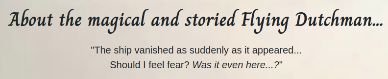

# **Flying Dutchman Voyages - _"Sailing Until Doomsday!_**

## **Project Overview**

Flying Dutchman Voyages offers a one-of-a-kind experience - cruises on the fabled ghost ship, The Flying Dutchman. Customers are able to choose from a modest selection of unique rooms on board, from the opulent Captain's Quarters (of which the spectral Captain Hendrick Van der Decken no longer has any need), to 'The Brig' - lovingly named so for its location, though it is anything but a prison. They can make and manage bookings, learn a little about the vessel itself, as well as discover the spectacular events Flying Dutchman Voyages has to offer.


[**_Please follow this link to the final deployed version of this project._**](https://flying-dutchman-voyages-f488bfe43a6a.herokuapp.com/)

## **Table of Contents:**

1. [**Project Overview**](#project-overview)
1. [**Planning Stages**](#planning-stages)
    - [**Site Aims**](#site-aims)
    - [**Scope**](#scope)
    - [**User Stories**](#user-stories)
    - [**Server Side**](#server-side)
        - [**_Data Models_**](#data-models)
        - [**_Entity Relationship Diagram_**](#entity-relationship-diagram)
    - [**Client Side**](#client-side)
        - [**_Colour Scheme_**](#colour-scheme)
        - [**_Typography_**](#typography)
1. [**Technologies Used**](#technologies-used)
1. [**Agile Development**](#agile-development)
1. [**Current Features**](#current-features)
    - [**Header and Navigation**](#header-and-navigation)
    - [**Home Page**](#home-page)
    - [**About Us Page**](#about-us-page)
    - [**Events Page**](#events-page)
    - [**Our Rooms Page**](#our-rooms-page)
    - [**Room Detail Page**](#room-detail-page)
        - [**_Booking Success Page_**](#booking-success-page)
    - [**AllAuth Pages**](#allauth-pages)
    - [**My Bookings Page**](#my-bookings-page)
        - [**_Amend Booking Page_**](#amend-booking-page)
        - [**_Cancel Booking Page_**](#cancel-booking-page)
    - [**Error Pages**](#error-pages)
        - [**_Login Error Page_**](#login-error-page)
    - [**Footer**](#footer)
1. [**Considerations for Future Enhancements**](#considerations-for-future-enhancements)
    - [**Contact Form**](#contact-form)
    - [**Additional Booking Functionality**](#additional-booking-functionality)
    - [**Email as Username**](#email-as-username)
    - [**Slugs**](#slugs)
1. [**Testing**](#testing)
1. [**Deployment**](#deployment)
    - [**Cloning/Forking**](#cloningforking)
    - [**Project Setup**](#project-setup)
    - [**Setting Up the Database**](#setting-up-the-database)
    - [**Environment Variables and Settings**](#environment-variables-and-settings)
    - [**Cloudinary**](#cloudinary)
    - [**Deployment to Heroku**](#deployment-to-heroku)
1. [**Credits**](#credits)
    - [**Honourable Mentions**](#honourable-mentions)
    - [**Code and Content References**](#code-and-content-references)
        - [**_Code_**](#code)
        - [**_Content and Media_**](#content-and-media)

## **Planning Stages**

### **Site Aims**

The primary aim for the Flying Dutchman Voyages project is to provide a seamless, user-friendly link between the services offered by Flying Dutchman Voyages, and potential customers looking to make a booking for a voyage. This link crucially includes information about The Flying Dutchman, and provides site users with a clear view of the rooms available to them. It provides the means to make a booking, amend existing bookings, and cancel bookings with ease - remaining clear and consistent for a smooth user experience.

Additionally, from the perspective of site admins, it provides a user-friendly way to manage site content by adding, removing and updating rooms, as well as the ability to view, update and cancel all bookings made by users through the site - all from one convenient admin page.

### **Scope**

When planning the project, I initially made a mind map using [**_Excalidraw_**](https://excalidraw.com/) of what I felt the project should contain - although crude, it helped me begin formulating what I thought the models should look like and I was able to build from there.


From here, I expanded on this basic mind map and put some consideration into other features I'd like the project to have, such a contact form, and also put more thought into what each room (or, room category at the time) would look like. I was then able to filter these requirements into three categories: 'must have', 'should have', and 'could have'. By doing this, I was able to determine the MVP, as well as consider the agile epics that could be broken down into user stories.

### **User Stories**

The four agile epics that were determined by the scope mindmap are as follows:

1. **Login/Registration (Must Have):**
    * User - the ability for new users to create an account, and returning users to log in to access content only available for authorised users.
    * Admin - the ability for administrators to securely log in to access the site and admin dashboard.

1. **Bookings (Must Have):**
    * User - the ability to access booking functionality on the website, create bookings that are saved into a database, and amend/cancel those bookings from a convenient and secure view.
    * Admin - the ability to access booking data that has been made by all users on the website, and view/amend/cancel those individual bookings when needed from the secure admin dashboard.

1. **Events (Should Have):**
    * User - the ability to access information about the various events held by Flying Dutchman Voyages.

1. **Contact (Could Have):**
    * User - the ability to securely send enquiries through a contact form on the website.
    * Admin - the ability to securely access enquiries sent by users, and respond to them.

From these four epics, the following user stories were created:

**Login/Registration (Must Have):**
* **Admin login:** As a _Site Admin_ I can securely login to the admin dashboard so that I can view and manage booking options, manage/delete user accounts, and amend details of available bookings.
* **User registration:** As a _Site User_ I can create an account so that I am able to make and manage my bookings.
* **User login:** As a _Site User_ I can clearly see that I am logged in so that I know I am able to make and manage my bookings.

**Booking (Must Have):**
* **Manage bookings (admin):** As a _Site Admin_ I can see bookings that have been made so that I can modify and delete them if necessary/contact the user with relevant information.
* **Access booking calendar:** As a _Site User_ I can access the booking calendar so that I can see the dates available to book trips.
* **Create booking:** As a _Site User_ I can create a booking so that I can secure a place on a voyage.
* **Manage bookings (user):** As a _Site User_ I can manage any bookings I have made so that I can edit or delete them as necessary.

**Events (Should Have):**
* **Access event information:** As a _Site User_ I can clearly navigate to the events section so that I can see all events that might be of interest to me.

**Contact (Could Have):**
* **Contact (user):** As a _Site User_ I can clearly access the contact form so that I am able to make enquiries.
* **Contact (admin):** As a _Site Admin_ I can securely access messages sent through the website so that I can respond to user queries.

The user stories were entered into the [**_GitHub Project Board linked to the Flying Dutchman Voyages repo_**](https://github.com/users/emmacadavra/projects/3/views/1) for me to monitor and keep track of my progress with them whilst building this project. Further notes on these can be found in the **User Story Notes and Revisions section** of my separate [**_AGILE.md_**](AGILE.md) document.


### **Server Side**

#### **Data Models**

When planning for the project, these were the considerations I made for the models:

1. **User Model:**
* The User model will be imported from Django AllAuth, which will have a one-to-many relationship with the Room and Booking models - one User can have multiple Bookings across multiple Rooms, but every booking is unique to one User and will never be available to other Users.

1. **Room Model:**
* The Room model will allow for admins to create, edit and delete rooms from the database, but will not be editable by Users. Each room in the Room model has a one-to-many relationship with both the User and Booking models - every room can have multiple bookings associated with it for multiple Users, but again every booking is unique to only one User and one Room.

1. **Booking Model:**
* The Booking model allows for Users to create, amend and delete bookings made through the booking form for a specific room. Every booking is unique to the User and room, and ensures that no bookings can be made for rooms that have already been booked on certain dates. It stores the data on the database and fetches data using the unique booking ID if the User is authenticated, so that the User is able to manage the booking.

#### **Entity Relationship Diagram**

Below is an updated version of my initial ERD to include the current model fields (the Room model only includes image & alt text fields once for the sake of space), made using [**_Excalidraw_**](https://excalidraw.com/):


The User interacts with the booking process initially by being introduced to the different rooms available. When the user clicks to view a specific room, they are then able to make a booking for that room. Their request is validated by the booking form, linked to the Booking model and returned to the User if invalid with information about why it was invalid. If valid, their booking is successfully created, and the User can then access that booking information to cancel it if they want to, or amend it (in which case a similar process will begin again where validation checks are performed to make sure the User is able to make those changes).

### **Client Side**

#### **Colour Scheme**

Before I started working on the styling of the website, I was fortunate enough to come across this beautiful painting titled 'The Flying Dutchman', by Charles Temple Dix. I had already decided that I wanted a somewhat light and airy theme for the website and this provided me not only with the perfect background images for the site, but also a great place to start in terms of colour scheme.


I also found I like the info button colour styling that was provided by Bootstrap4, so I started off very simple with this colour palette from [**_mycolor.space_**](https://mycolor.space/):


I also used [**_mycolor.space/gradient3_**](https://mycolor.space/gradient3) for the gradients seen in the header and footer.

To expand on the palette and rework it closer to the colours seen in Charles Temple Dix's painting, I uploaded the image to [**_colormind.io_**](http://colormind.io/) to generate additional colours to use on the website. Below is a colour grid created by [**_contrast-grid.eightshapes.com_**](https://contrast-grid.eightshapes.com/?version=1.1.0&background-colors=&foreground-colors=%2353adbb%2C%0D%0A%233d5246%2C%0D%0A%23303030%2C%0D%0A%23080808%2C%0D%0A%23212529%2C%0D%0A%23f3ead7%2C%0D%0A%23f2efe080%2C%0D%0A%23f2efe0cc%2C%0D%0A%23f4f2e3%2C%0D%0A&es-color-form__tile-size=compact&es-color-form__show-contrast=aaa&es-color-form__show-contrast=aa&es-color-form__show-contrast=aa18&es-color-form__show-contrast=dnp) that includes the final colours used across the website:


#### **Typography**

For the main titles and some occasional features on the site, I decided to use the font 'Charm', found on Google Fonts. I felt this font was a perfect balance between extravagant and decorative, whilst remaining clear and readable. I feel it accurately carries the theme of the website without being too overpowering.

For the main body of the website I considered using a different font to Bootstrap4's native font stack, however I found that I quite liked the contrast between it and 'Charm', as they seem to compliment one another in an unexpected and simple way.

## **Technologies Used**

* Python
* Django
* Heroku
* ElephantSQL
* HTML5
* CSS3
* Bootstrap4
* Javascript (through Bootstrap4)
* FontAwesome
* Cloudinary

## **Agile Development**

Throughout this project, I adopted an agile approach, which I have detailed and reflected on in my separate [**_AGILE.md_**](AGILE.md) document.

## **Current Features**

Below are the main features across the website. For the sake of consistency, I have taken all desktop screenshots in Chrome on my computer (screen resolution 1920x1280px - however this includes the browser bar so viewable area is slightly smaller), and all mobile screenshots through Chrome's DevTools, using the iPhone 12 Pro setting (resolution 390x844px), due to this seeming like a good standard choice in mobile size.

### **Header and Navigation**

The header of the site is simple, with a pleasing colour gradient that compliments the overall colour scheme of the site. To the left is the company brand - where the user expects to see it. This brand section also functions as a link to the homepage, again as users have come to expect from websites.

When a user is not logged into the website, the following information is shown in the navbar, including links to register for the site, and login:


However, when I user is successfully logged in, the display changes, allowing them to access any bookings made and log out:


When viewing the website on a screen that is smaller than the full width the navbar needs to be displayed properly, it becomes a collapsible menu on the right hand side.


The menu items are visible when clicking the icon, and they expand downwards - pushing the page content down, so as not to cause any conflicts with the information on the page.


### **Home Page**

The homepage is simple and clean whilst also being exciting and engaging. The gorgeous painting used as the background image draws people's attention to the boat in the foreground, before it slowly dawns on them that there's actually a much bigger boat in the background that is more interesting (and relevant to the site). 


The homepage features a main site title, a lead paragraph below it with the company's slogan, and then three cards with links that take the user to the About Us, Our Rooms, and Events pages.

The homepage is responsive, and on mobile lo

 

### **About Us Page**

The About Us page features some engaging images and interesting information about The Flying Dutchman, as well as Flying Dutchman Voyages.

The page title and lead paragraphs create a sense of mystery and intrigue, playing to peoples' curiosity so that they read on.



Below the title, the main section can be found, which is split into two parts, that are themselves split into two. The first section shows a spectacular image of the ship (much of the imagery used across the site is artwork rather than photography - for obvious reasons!), next to a text area that includes a quote about the legend of The Flying Dutchman, and a quirky rebuttal about the 'real' fate of the ship.


The second part of the man section also features a text area and an image, but this time reversed to keep the page layout engaging and interesting. This is where users can see another brilliant image and find out more about the voyages on offer.


The webpage is fully responsive, and when the screen size is reduced to a certain width, the direction of the content changes, making it much easier to digest on mobile screens:


### **Events Page**

The Events page features a title area with a lead paragraph containing a contact email address for Flying Dutchman Voyages.


Below this, there are two main areas on the page. Firstly, a section covering holiday events. The three events currently showing are Christmas, New Year and Halloween, each with a unique and fascinating image. The specific information about these events is not included on the webpage, as users are encouraged to contact Flying Dutchman Voyages to discuss them first. 


Below the holiday events lies what I consider "the main event". This is a special voyage that takes place every year on Easter Sunday - the day on which the captain of the real Flying Dutchman allegedly ordered his men to set sail despite it being considered blasphemy to sail on Easter Sunday in those times. The ship never made it to port, and ghost stories were created from it. I was extremely keen to make sure this particular event was featured on the site, as it really characterises the bizarre nature of Flying Dutchman Voyages!


The second section features wording that boldly warns passengers that return is not guaranteed from this voyage, as the ship is literally spirited away and cannot therefore ever guarantee that it will always return.


This page is fully responsive, following the same layout rules seen in the About Us page.

### **Our Rooms Page**

The Our Rooms page features an image and very brief sentence of flavour text about each room available:


This page uses flex-wrap to make sure that the page layout is always responsive:


### **Room Detail Page**

Clicking through to any of the rooms on the Our Rooms page will take you to the Room Detail page for that room. This is a single Django template that takes the ID associated with whichever room is selected, and appends that to the URL to take the user to the correct room.

The user is met with a large carousel of three unique images per room, and a description of the room itself.


Below this, the details of the room (the number of beds & maximum number of passengers) is displayed next to the booking form.


The booking form includes validation logic to ensure that the user will be informed if they try submitting a form with invalid data, from incorrect data types, too many passengers, to booking dates not being available for that room.

#### **Booking Success Page**

The booking success page gives the user clear feedback that a booking they have tried to make through the booking form has been successful. It also provides a clear link to the My Bookings page, in which they can view their booking details and manage their bookings.


### **My Bookings Page**

The My Bookings page (also called the manage-bookings page in code) features a clear title to let the user know that they can view and edit their bookings here.


The page itself features centred cards that display basic overview information about the booking, as well as one of the images associated with the room.


The list of bookings is paginated, never exceeding three bookings per page due to the large area each booking takes up for styling reasons.


#### **Amend Booking Page**

The Amend Booking page can only be accessed by clicking the Amend Booking button next to the relevant booking in My Bookings, or by directly appending the booking ID to the /manage_bookings/amend/ url **IF** it is done by the user who made that booking, when they are logged in. Otherwise, a 404 error is displayed.


When a booking has been successfully amended, the user is met once again with the Booking Success page.

#### **Cancel Booking Page**

The Cancel Booking page looks similar to the Amend Booking page, and is similarly only accessible by the link next to the specific booking, or by adding the booking ID to the /manage_bookings/cancel/ url **IF** it is done by the user who made that booking, when they are logged in. Otherwise, a 404 error is displayed.


When a booking is successfully cancelled, the user is returned to the My Bookings page and a message appears to notify them that the booking has been cancelled.


### **AllAuth Pages**

The account registration, login and logout pages provided by Django AllAuth have been styled to match the homepage to create a sense of familiarity. The Login and Logout pages also feature messages that appear to the user when they have successfully logged in or out.

#### **Register Page**


#### **Login Page**


#### **Logout Page**


### **Error Pages**

Custom error pages have been created for the two most common errors users are likely to encounter: the 404 page and the 500 page. Creating a custom 400 page was particularly important, as if a user tries to enter a booking ID to the end of the /manage_bookings/amend/ or /cancel/ URLs that they did not make, it is important to make sure they are met with a 404, rather than a page asking them to login/telling them they are not authorised to perform the action, as this could jeopardise the security of the website.

They have been styled similarly to the homepage due to wanting to instil the sense of familiarity associated with the brand and this background image.


#### **Login Error Page**

This page appears when a user tries to create a booking when they are not logged in. It has been styled similarly to those above and for the same reason.


### **Footer**

The footer is simple, using a gradient like the header, but instead going from a deep sea green to the same turquoise colour used at the beginning of the header. I think this contrast is visually appealing without taking too much of the user's attention.

Within the footer are social media links.


## **Considerations for Future Enhancements**

### **Contact Form**

One of the things I would most like to implement to this project in future is a contact form, which I ended up not including in the initial development of this project. More information about this can be found in the **User Story Notes** section of my separate [**_AGILE.md_**](AGILE.md) document.

### **Additional Account & Booking Information**

Currently, when users sign up for the website to make a booking, they only need to enter a username and password. For the scope of this project, that is fine - however in the future I would like to look into implementing a more robust account creation process that means users must enter in details such as their full name, age, address, etc. This would mean that the booking information stored on the database would be more useful to the site owners and be more realistic for a booking website.

Additionally, I would like to add a feature to the booking process that asks for the names of additional passengers.

### **Email as Username & Email Confirmation**

Following on from the above, current users need only register with a username and password, which would be fine if this were a blog or Reddit-style website, but for a booking website I feel that using an email address for a username (and removing the 'username' part entirely so it's only the email address) would be more appropriate. It would also mean that users can receive email confirmations for their bookings, and it would be easier for site admins to manage bookings made on the site.

When starting this project, I implemented the basic Django AllAuth account creation, but didn't consider until later the impact that favouring usernames over email addresses would have on future enhancements. I plan to look into this with the hopes of implementing a reformed account creation system in future.

### **Slugs**

When I first created this project, my Room model contained a dictionary called "ROOM_CATEGORIES" that included a room category string (ie. "CAPQ") and then a name string (ie. "Captain's Quarters"). This was because I had originally intended on having more than one of a certain room category available. Each room category's URL would be generated from the category string, and the page would be populated with the name string. Because I worked like this for a while before refactoring my code, when it came to refactoring I focused instead on having one of each room, and using the room's primary key as its ID which is fed to the URL. Unfortunately it occurred to me a little too late that it might be better to add a slug field into the Room model - by which point so much of my code had been written around URLs being generated by room IDs that it became unfeasible to refactor it again to accommodate slugs instead. However, I think the site would benefit from this addition and I intend to implement it in future. 

## **Testing**

A separate file has been created for information about testing. Please click the following link to access it: [**_TESTING.md_**](TESTING.md)

## **Deployment**

In this section I explain the steps I took in order to deploy this project.

### **Cloning/Forking**

If you wish to create a clone of this project to use on your local machine or virtual IDE environment such as Gitpod, first navigate to [this project's GitHub Repository](https://github.com/emmacadavra/flying-dutchman-voyages), and follow [GitHub's instructions on how to clone a repository](https://docs.github.com/en/repositories/creating-and-managing-repositories/cloning-a-repository). If you are using a local environment, you can enter the following command in the terminal:
```pip install -r requirements.txt```
This will install all the required libraries and packages in one go, meaning you will not have to follow the set-up steps below.

As I developed this project locally, I had to create a virtual environment using the command ```python -m venv .venv``` - if you clone this project to use locally, you must do the same. Ensure that the virtual environment is not tracked by version control by adding it to the .gitignore file.

### **Project Setup**

Below is a list of the steps and terminal commands I used to install the necessary libraries and packages for this project following the creation of the GitHub repository:

1. Create a virtual environment (as mentioned above):
    * ```python -m venv .venv```
    * Add the .venv file to .gitignore
1. Open the virtual environment and install Django with Gunicorn:
    * ```pip3 install 'django<4' gunicorn```
1. Install the supporting database libraries:
    * ```pip3 install dj_database_url==0.5.0 psycopg2```
1. Install Cloudinary libraries:
    * ```pip3 install dj3-cloudinary-storage```
    * ```pip3 install urllib3==1.26.15```
1. Create a 'requirements.txt' file:
    * ```pip3 freeze --local > requirements.txt```
1. Create the Django project:
    ```django-admin startproject project_name .``` (note: 'project_name' in this case is 'flying_dutchman' - do not forget the '.' after the project name)
1. Create a Django app:
    * ```python3 manage.py startapp app_name``` (note: 'app_name' in this case is 'fd_bookings'. A separate app should be created for each major aspect of the project - for example I plan to create a contact form in future which will require its own app as it is separate from the booking functions)
1. In 'settings.py', which is created in the main project directory, add the following apps to the 'INSTALLED_APPS' section:
    * 
1. Run the following command to make migrations:
    * ```python3 manage.py makemigrations```
1. Run the following command to migrate changes:
    * ```python3 manage.py migrate```
1. Run the following command to run the server and test whether the project is working locally:
    * ```python3 manage.py runserver```
1. The Django success page should now show, but if not, the 'ALLOWED_HOSTS' section of 'settings.py' needs updating to include the URL given by Django if an error is displayed.

### **Setting Up the Database**

This project uses [**_ElephantSQL_**](https://www.elephantsql.com/) to host its database. Below are the steps I took following account creation:
1. Click on 'Create New Instance'
1. Provide a project name and select the 'Tiny Turtle (Free)' plan
1. Click 'Select Region' and choose a nearby data centre
1. Review the details of the project before returning to the dashboard
1. Copy the ElephantSQL URL, which starts with 'postgres://', in order to link it to the Django project (detailed further below)

### **Environment Variables and Settings**

1. Create a file in the main project directory called 'env.py', and add it to the .gitignore file - this files stores private environment variables and must be kept hidden
1. Add the key 'DATABASE_URL' to env.py and assign it the ElephantSQL URL as a value:
    * ```os.environ["DATABASE_URL"] = "postgres://ElephantSQL Database URL"```
1. Add the key 'SECRET_KEY' to env.py and assign it something secret (and more secure than "SecretKey123"!) as a value:
    * ```os.environ["SECRET_KEY"] = "SecretKey123"```
1. Navigate to the 'settings.py' file and make sure the following code is added to the top of the file:
    * 
1. Replace Django's default 'DATABASES' in the with the following code:
    * 
1. Replace Django's default 'SECRET_KEY' with the following code:
    * 
1. Add the following code to 'settings.py' to correctly link up project templates:
    * ```BASE_DIR = Path(__file__).resolve().parent.parent```
    * ```TEMPLATES_DIR = os.path.join(BASE_DIR, 'templates')```
    * 

### **Cloudinary**

[**_Cloudinary_**](https://cloudinary.com/) is installed as part of this project in order to host media and static files. Below are the steps I took following account creation and installing Cloudinary through Django:
1. Navigate to the Cloudinary Dashboard
1. Copy the code from the 'API Environment variable', section of the Dashboard:
    * 
1. Add the key 'CLOUDINARY_URL' to 'env.py' and assign it the Cloudinary API URL as a value:
    * ```os.environ["CLOUDINARY_URL"] = "cloudinary://Cloudinary API URL"```
1. Add the following code to 'settings.py' to tell Django to use Cloudinary to store and manage media and static files:
    * 


### **Deployment to Heroku**

This project is hosted on [**_Heroku_**](https://www.heroku.com/). Below are the steps I took to deploy my project following account creation, project setup and database setup with [**_ElephantSQL_**](https://www.elephantsql.com/):

1. On the Heroku Dashboard, create a new app. The app name must be unique and should be related to the Django project name
1. Set location as appropriate

1. Open the 'Settings' tab and navigate to 'Config Vars' - Click 'Reveal Config Vars'
1. Add the following config vars:
    * ```PORT = 8000```
    * ```DATABASE_URL = postgres://ElephantSQL Database URL``` (note that this must be the unique ElephantSQL URL from the created database)
    * ```SECRET KEY = SecretKey123``` (note that this must be the unique secret key made previously for this project)
    * ```CLOUDINARY_URL = cloudinary://Cloudinary API URL``` (note that this must be the unique Cloudinary API URL obtained previously)
1. Add the following temporary config var (to be removed before final deployment):
    * ```DISABLE_COLLECT_STATIC = 1```
1. Obtain the project URL from Heroku, and add it to the 'ALLOWED_HOSTS' section of 'settings.py'
1. Create a Procfile in the root project directory and add the following code:
    * ```web: gunicorn project_name.wsgi``` (note that 'project_name' must be the same as the Django project)
1. Save all project files, and use the following commands to add, commit and push the changes to the GitHub repository:
    * ```git add .```
    * ```git commit -m "Initial commit"```
    * ```git push```
1. Navigate to the 'Deploy' tab in the Heroku dashboard and link the GitHub repository to the project.
1. Manually deploy from the main GitHub repository branch.

## **Credits**

### **Honourable Mentions**

* [**_Damon Kreft_**](https://github.com/damon-kreft) - words cannot express how much I value your knowledge, care and encouragement. This project was built during a particularly difficult time, and I don't think I could have continued on in the way that I did without your love, encouragement and support. Thank you as always from the bottom of my heart for always having my back and inspiring me to grow.

* [**_Richard Wells_**](https://github.com/D0nni387) - to me you are not just a mentor but an absolutely angelic source of wisdom, encouragement and support. I will never be able to thank you enough for the sheer amount of time and effort you dedicate to supporting me with my learning and creating such a comfortable space to explore what I have been learning along the way.

* [**_Kieran Peat_**](https://github.com/kieranpeat) - thank you so much for always taking such an eager interest in my projects, and dedicating time to trying them out and providing feedback despite your limited time to do so. Thank you also for reliably being "my friend with a Mac" that I can turn to when Safari won't play ball! 

* [**_Carach Angren_**](https://www.carach-angren.nl/) - as mentioned in the [**_Content and Media_**](#content-and-media) section below, I have taken some direct quotes from songs written by Carach Angren, but I wanted to include them here as well just because it wouldn't feel right not to do so. Every album released by this band is themed and feels more like musical storytelling than anything else. I was always interested in ghost stories, and stories of ghost ships as well, but 'Death Came Through a Phantom Ship' is my favourite album by this band and it inspired a large amount of the content of the project.

### **Code and Content References**

#### **Code**

* This project followed the Code Institute code-along projects 'Hello Django' and 'I Think Therefore I Blog', and although this project is vastly different in terms of the type of project, there will inevitably be similarities in certain parts of the code. For example, certain template code such as the code used to paginate the 'My Bookings' page, and code within .py files such as the classes found in admin.py.

* This project was built with Django, and as such there will be many instances throughout my code that have been taken from the [**_Django 3.2 Documentation_**](https://docs.djangoproject.com/en/3.2/), or built upon from their given examples.

* Similarly, a great deal of this project's styling relies on Bootstrap4, and there will be many instances throughout my code that have been taken from the [**_Bootstrap4.6 Documentation_**](https://getbootstrap.com/docs/4.6/getting-started/introduction/), or built upon from their given examples.

* At the start of my project, I came across [**_DarshanDev's YouTube Channel_**](https://www.youtube.com/@darshandev1754) and found his Django Hotel Management System Tutorials to be absolutely invaluable to me ([**_Video #1 HERE_**](https://www.youtube.com/watch?v=yenjz1Wv9Yo), [**_Playlist HERE_**](https://www.youtube.com/playlist?list=PL_6Ho1hjJirn8WbY4xfVUAlcn51E4cSbY) - playlist does not contain video #1). Although I ended up refactoring almost all of the code explained in this video, he really helped me understand how each part of the project was working together.

* The following code for the ```__init__``` function within a Form came from [**_Emanuele Paolini on StackOverflow_**](https://stackoverflow.com/questions/14660037/django-forms-pass-parameter-to-form):
    * 

* Although I wrote the code myself, [**_Damon Kreft_**](https://github.com/damon-kreft) deserves to be credited for teaching me about the ```clean``` function in Django Forms and how I could add to it, including helping me find the above StackOverflow answer.

* I wasted a lot of time trying to wrap my head around the best way to integrate a date picker into my Django Form, rather than have the default date entry field that includes a huge margin for user error. I am extremely grateful to [**_Asim Zahid on Medium_**](https://mrasimzahid.medium.com/how-to-implement-django-datepicker-calender-in-forms-date-field-9e23479b5db) for writing this article and providing the solution:
    * 
    * 

* Throughout the project, I often utilised and relied upon Code Institute's Slack channel and community, as well as using other online resources such as StackOverflow and W3Schools.

#### **Content and Media**

* The About Us page features three quotes in total - two of which are song lyrics written by [**_Carach Angren_**](https://www.carach-angren.nl/).
    * "The ship vanished as suddenly as it appeared... Should I feel fear? Was it even here..?" - _'The Sighting Was a Portent of Doom'_ from the album _'Death Came Through a Phantom Ship'_
    * "I will round the Cape, even if I have to sail until Doomsday!" - _'Departure From a Nautical Curse'_ from the album _'Death Came Through a Phantom Ship'_

* The third quote on the About Us page comes from [**_this downloadable document_**](https://www.woodbury-central.k12.ia.us/common/pages/DisplayFile.aspx?itemId=9931541), courtesy of Woodbury Central Community School District. The work appears to be 'Maritime Ghosts' by Tony Ellis, though I was unable to find any more information about its origins.

* All icons used are from [**Font Awesome**](https://fontawesome.com/)

* All fonts have been imported from [**Google Fonts**](https://fonts.google.com/)

* Colour palettes from [**_mycolor.space_**](https://mycolor.space/), [**_mycolor.space/gradient3_**](https://mycolor.space/gradient3) and [**_colormind.io_**](http://colormind.io/)

* Colour contrast grid from [**_contrast-grid.eightshapes.com_**](https://contrast-grid.eightshapes.com/?version=1.1.0&background-colors=&foreground-colors=%2353adbb%2C%0D%0A%233d5246%2C%0D%0A%23303030%2C%0D%0A%23080808%2C%0D%0A%23212529%2C%0D%0A%23f3ead7%2C%0D%0A%23f2efe080%2C%0D%0A%23f2efe0cc%2C%0D%0A%23f4f2e3%2C%0D%0A&es-color-form__tile-size=compact&es-color-form__show-contrast=aaa&es-color-form__show-contrast=aa&es-color-form__show-contrast=aa18&es-color-form__show-contrast=dnp)

* Mind map and ERD drawn on [**_Excalidraw_**](https://excalidraw.com/)

* Images and static files hosted by [**_Cloudinary_**](https://cloudinary.com/)

* **Images:**

    * Main background image (including cropped version used for some page backgrounds): [**_'The Flying Dutchman' by Charles Temple Dix_**](https://commons.wikimedia.org/wiki/File:The_Flying_Dutchman_by_Charles_Temple_Dix.jpg)
    * All three Captain's Quarters images: [**_'Captain's Cabin' by WONJIN on ArtStation_**](https://www.artstation.com/artwork/RnzxOX)
    * [**_'Ghost Ship' by awester01 on DeviantArt_**](https://www.deviantart.com/awester01/art/Ghost-Ship-949058730)
    * [**_'The Flying Dutchman' by Koalafish on DeviantArt_**](https://www.deviantart.com/koalafish/art/AI-Art-The-Flying-Durchmen-939757202)
    * [**_'High-seas encounter' by George Grie at neosurrealismart.com_**](https://www.neosurrealismart.com/surreal-pictures/176-Ghost-ship-series-High-seas-encounter-web.jpg)
    * [**_'Phantom Voyage' by George Grie at neosurrealismart.com_**](https://www.neosurrealismart.com/surreal-pictures/177-Ghost-ship-series-Phantom-Voyage-web.jpg)
    * [**_'Ship Shipwreck Sea' by 51581 on pixabay.com_**](https://pixabay.com/illustrations/ship-shipwreck-sea-waves-tall-ship-1366926/)
    * [**_'AI Generated Ship Galleon' by ChesterMirt on pixabay.com_**](https://pixabay.com/illustrations/ai-generated-ship-galleon-sea-8252763/)
    * [**_'AI Generated Pirate Ship Phantom Ship' by SerenityArt on pixabay.com_**](https://pixabay.com/illustrations/ai-generated-pirate-ship-8316938/)
    * [**_'Captain's Room' by xPuNkYx on DeviantArt_**](https://www.deviantart.com/xpunkyx/art/Captain-s-Room-298360401)
    * [**_'Second Class stateroom on the 'Balmoral Castle' (1910) RMG G10619' by Bedford Lemere & Co. Wikipedia Commons_**](https://commons.wikimedia.org/wiki/File:Second_Class_stateroom_on_the_%27Balmoral_Castle%27_(1910)_RMG_G10619.tiff)
    * [**_Second Class cabin E-90 on board the RMS Olympic, 1911 by Bedford Lemere & Co. on Wikimedia Commons_**](https://commons.wikimedia.org/wiki/File:2nd_Class_Cabin_E-90_of_the_Olympic.jpg)
    * [**_'La Grace - kapitanská kajuta' by Luděk Kocourek on Wikimedia Commons_**](https://en.m.wikipedia.org/wiki/File:La_Grace_-_kapitansk%C3%A1_kajuta.jpg)
    * [**_'Captain Sigsbee in the Captain's cabin on board the "Maine"' from the British Library_**](https://commons.wikimedia.org/wiki/File:Sigsbee_Captains_Cabin.jpg)
    * [**_'Civil War Naval Museum, USS Hartford Captain's cabin' by The Island Kings on Flickr_**](https://www.flickr.com/photos/divemasterking2000/3354364880)
    * [**_'Civil War Naval Museum, USS Hartford Captain's cabin' by The Island Kings on Flickr_**](https://www.flickr.com/photos/15775662@N00/3293703037/)
    * [**_'Sailors Hammocks onboard Nelsons flagship HMS Victory' by unknown, posted by Albertbailey on r/CozyPlaces_**](https://www.reddit.com/r/CozyPlaces/comments/e1q68v/sailors_hammocks_onboard_nelsons_flagship_hms/)
    * [**_'Grand Turk, a replica of a three-masted 6th rate frigate from Nelson's days. - hammock' by Georges Jansoone on Wikimedia Commons_**](https://commons.wikimedia.org/wiki/File:Grand_Turk(38).jpg)
    * [**_'HMS Warrior hammocks and cannons' by Chris Waits on Wikimedia Commons_**](https://commons.wikimedia.org/wiki/File:HMS_Warrior_hammocks_and_cannons.jpg)
    * [**_'Une Chambre d' Officier à Board' by unknown mid 19th century, posted by Itwilliammowett on Tumblr_**](https://www.tumblr.com/ltwilliammowett/636211568466640896/une-chambre-d-officier-%C3%A0-board-by-unknown-mid)
    * [**_'Las Palmas ( Gran Canaria ). Casa de Colon - Collections. Reconstruction of Columbus' cabin on the Santa Maria in 1492' by Wolfgang Sauber on Wikimedia Commons_**](https://commons.wikimedia.org/wiki/File:Las_Palmas_Casa_de_Colon_-_Museum_Kolumbus_Kaj%C3%BCte_1.jpg)
    * [**_'Las Palmas ( Gran Canaria ). Casa de Colon - Collections. Reconstruction of Columbus' cabin on the Santa Maria in 1492' by Wolfgang Sauber on Wikimedia Commons_**](https://commons.wikimedia.org/wiki/Category:Casa_de_Col%C3%B3n_(Las_Palmas_de_Gran_Canaria)_-_Collections#/media/File:Las_Palmas_Casa_de_Colon_-_Museum_Kolumbus_Kaj%C3%BCte_2.jpg)
