# **Flying Dutchman Voyages - Testing**

## **Table of Contents (Testing):**

1. [**Testing Throughout Development**](#testing-throughout-development)
    - [**Manual Testing**](#manual-testing)
        - [**_Python and Django Testing_**](#python-and-django-testing)
        - [**_Front End Testing_**](#front-end-testing)
    - [**Noteworthy Bugs During Development**](#noteworthy-bugs-during-development)
        - [**_Virtual Environment_**](#virtual-environment)
        - [**_Linking Templates_**](#linking-templates)
        - [**_Valid Form_**](#valid-form)
        - [**_Required Fields in Templates_**](#required-fields)
        - [**_Switching Database_**](#switching-database)
        - [**_Room Categories_**](#room-categories)
        - [**_Exceeding Max Number of Passengers_**](#exceeding-max-number-of-passengers)
        - [**_Flex vs Grid_**](#flex-vs-grid)
        - [**_Cloudinary Image Alt Text_**](#cloudinary-image-alt-text)
        - [**_No Flexible Images_**](#no-flexible-images)
1. [**Post Development Testing**](#post-development-testing)
    - [**Post Development Bugs**](#post-development-bugs)
        - [**_Static Files_**](#static-files)
        - [**_Check Availability Function 1_**](#check-availability-function-1)
        - [**_Check Availability Function 2_**](#check-availability-function-2)
    - [**Responsive Design and Functionality**](#responsive-design-and-functionality)
    - [**Site Validation**](#site-validation)
        - [**_HTML and CSS_**](#html-and-css)
        - [**_PEP8_**](#pep8)
        - [**_Accessibility_**](#accessibility)
        - [**_Lighthouse Scores and Cloudinary_**](#lighthouse-scores-and-cloudinary)
        - [**_PageSpeed Insights_**](#pagespeed-insights)
    - [**Unresolved Bugs**](#unresolved-bugs)
        - [**_Safari_**](#safari)
1. [**User Story Testing**](user-story-testing)
    - [**As a Site User I can...**](#as-a-site-user-i-can)
    - [**As a Site Admin I can...**](#as-a-site-admin-i-can)

## **Testing Throughout Development**

### **Manual Testing**

#### **Python and Django Testing**

I used a variety of methods to test my Python / Django code as I went along, in particular using print statements to help me identify the code that was being passed between functions and templates, using the 'python3 manage.py runserver' command to test the interactivity between the Django models, views and templates, and finally by leaving myself comments that help me understand each line of code and what it's doing.

At the very beginning of the project, as soon as I had created my models, I created two very simple views that fed into for loops within two basic templates. This enabled me to see exactly what data was being generated from each model:

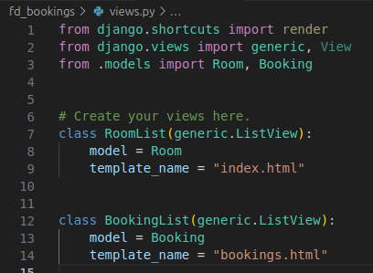

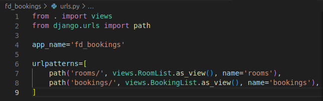

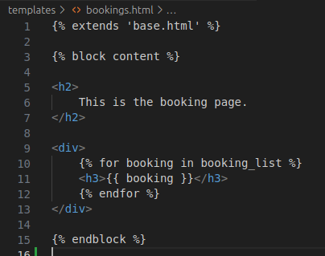

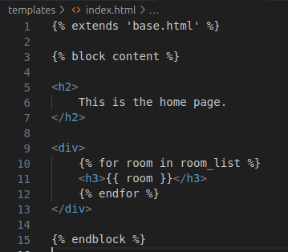

Outputs:

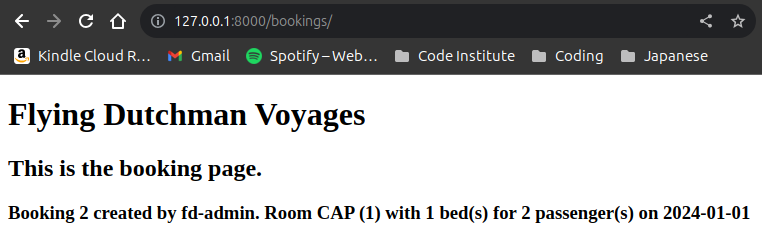

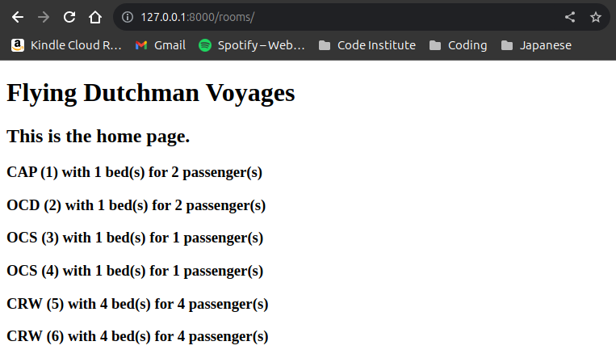

I found that doing this helped me visualise the code when testing.

Below is an example of using comments as I go to make sure I understand what each line of code is doing, which helped me (alongside the use of print statements!) to identify where issues might arise:

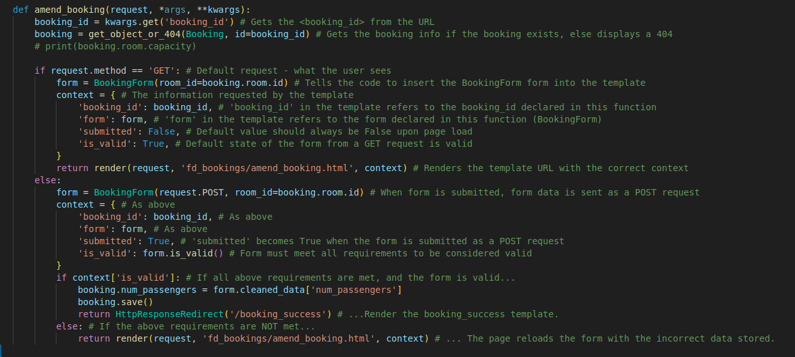

#### **Front End Testing**

Using the 'python3 manage.py runserver' command, I had a locally hosted version of this project running in the browser for 99% of the time spent working on it - however for the front end testing it played a much more interactive part thanks to Google Chrome's DevTools. With this, I was able to test and play around with styling elements, as well as getting a feel for the visual side of the user journey and how it looked on various different devices. This meant that when I wanted to implement a structural change to the page, or add new features such as a carousel of images, I was able to first test how those things would interact with the existing styling of the page, and make decisions about additional styling that may need to be included.

It was absolutely instrumental in ensuring that the site not only functioned as users expected in terms of the user journey and site logic, but also in seamless responsive design that is adaptive whilst retaining all the core site features.

### **Noteworthy Bugs During Development**

I faced many bugs during the development process - most of which can be attributed to still being a beginner with Django. I came across multiple instances of very similar bugs while working on the project, due to things like not providing views with the correct context for templates, or entering "room.name" in a template that was related to a view which accesses the Booking model, therefore requiring me to enter "booking.room.name". I haven't detailed these below, however, as they were numerous and easily fixed. Instead I've included other noteworthy bugs that I documented during the development process.

#### **Virtual Environment**

The first major issue I encountered as part of this project was that, due to using my own development environment on Ubuntu rather than using Code Institute's template in a cloud-based IDE, I was unable to install Python or Django to my local machine. To fix this, I learned how to set up a virtual environment on my machine and worked from there.

#### **Linking Templates**

Early on in the project, I had some issue getting to grips with the file paths needed to link templates to views. Two of my original templates linked to the views by wrapping just the filename in single quotes, 'rooms-list.html' and 'booking_list.html', but a third template, 'make_booking.html' would not work. I fixed this issue by learning that I needed to specify the file path as 'fd_bookings/make_booking.html'.

#### **Valid Form**

I considered not including this one, but decided to in the end as it did take up a considerable amount of my time! When working on the views that handle my booking form, I came across a bug that had me stumped for nearly two hours. The form was there in the template, but no matter what I tried it wouldn't submit to the database. I scoured the internet, combed through all of my code (or so I thought) for so long it gave me a headache - until I finally realised it was because within the view I'd mistakenly written "valid_form()" instead of Python's built-in "form_valid()"..!

#### **Required Fields in Templates**

The very early structure of my project included a dictionary with room categories inside, which determined the overall logic flow of the website and form. The 'make_booking.html' template originally served as the only place users could make a booking, and so the form fields included a dropdown list of room category names. This was marked as 'required' in the form, which caused bugs later on when I started changing the way the form looked in the webpages. At the time I had manually written the HTML for the form by first running the form.as_p and then getting the IDs from each element in DevTools, so when I changed the website structure to have one page per room, and removed the dropdown list from the template, trying to make a booking would throw an error because the user was unable to even enter a form field that I'd marked as required. To fix this, I used print statements in various locations within the function in RoomDetailView so that I could see where the code stopped being read, and what it was reading if it was being read. After realising it was because the form still included the 'required' field where it no longer needed to, I removed it from the form. I also decided to go back to rendering the form.as_p as I was unable to access Django's built-in form validation errors.

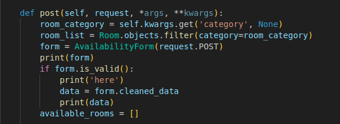

#### **Switching Database**

About half-way through development, I logged into ElephantSQL so that I could visually see the information that was in my database, only to realise that I had not linked the database to the project in the settings.py file. When I did this, I of course needed to create a new superuser, and enter in the room data through the admin dashboard from scratch. Not necessarily a bug, but it did set me back a little.

#### **Room Categories**

As mentioned above, originally my Room model contained a dictionary of room categories made up of a short "id" string and then the name in another string. The rationale behind this was that I had initially wanted to make it so that more than one room could be created per category (ie, four individual 'single cabin' rooms, etc.) However, during my second sprint I began massively refactoring a lot of my code (detailed more in the **Sprints** section of my separate [**_AGILE.md_**](AGILE.md) document) due to feeling like I'd overcomplicated a lot of it, and caused myself unnecessary confusion by doing things one way in one view, and then another way in a different view, etc. During this time I also realised that, with the current extent of my knowledge, I was creating more bugs than I was fixing by trying to find ways to include the form validation I needed whilst there were multiple rooms within some categories but not others (there can only be one 'Captain's Quarters', after all!). The refactoring that was required to make my code more consistent and less convoluted was ultimately worth it, but the biggest bugs I came across multiple times were due to me not focusing on the room categories first. The most noteworthy of these had to do with the room URLs, for which I had created a function within the Booking model itself that would pull the URL from the room category dictionary. When I started replacing the room category code with code relating to the room IDs, I caused a lot of issues for myself by overlooking this function and thinking the code was being executed by one of the views. I was testing the room views individually by entering the ID as part of the URL, but it took some time for me to realise that the reason I could no longer navigate to them from the Our Rooms page was because the template was still trying to call the function in the Booking model. The obvious fix for this one (once I found it!) was to remove the function from the model, as it was no longer needed, and update the templates in line with the refactored views.

#### **Exceeding Max Number of Passengers**

During my second sprint, I became aware of a bug in my code that meant users were able to create bookings with a total number of passengers that exceeded the specified room capacity. To begin with, I fixed this in the amend-booking function by adding 'is_valid' to the context as a key:

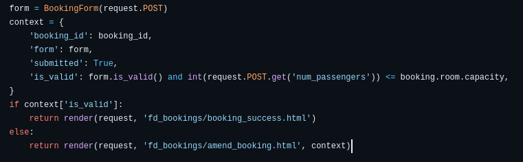

After confirming this worked, I considered doing the same thing within the RoomDetailView view before looking into Django form validation options in more detail. Eventually I was able to move this validation outside of the views and directly into the form itself, thanks enormously to [**_Damon Kreft_**](https://github.com/damon-kreft) who kindly demonstrated how it is possible to include additional validation rules into Django's built-in clean function:

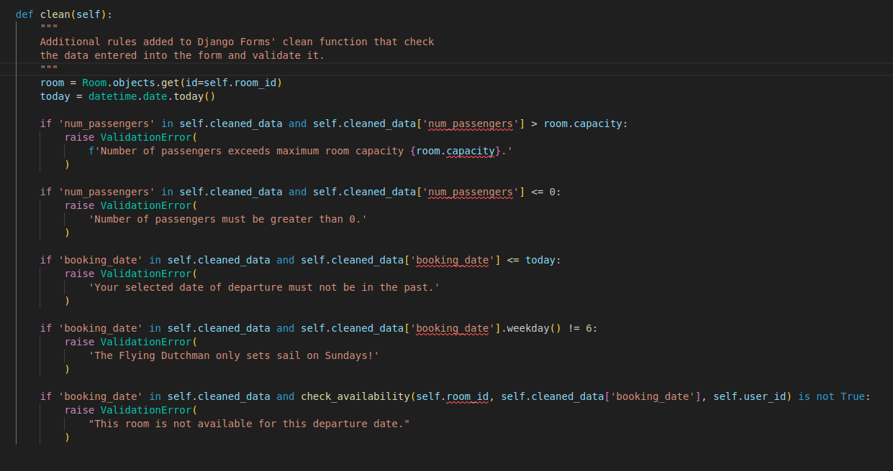

#### **Flex vs Grid**

When styling the website, in particular the homepage, I found I was running into a lot of bugs in the layout of the page. One that had me stumped for a while was an issue where the scrollbar disappeared, and I  was unable to scroll down the page to see any content that extended beyond the viewport. I was able to determine, after doing some research, that it was because I was trying to apply Bootstrap's grid classes to elements that also had flexbox classes, and creating a conflict. In the end I fixed this by sticking to flexbox classes for my webpages.

#### **No Flexible Images**

Following on from the previous issue, I ran into some bugs in my styling a few times where images were concerned. I had set maximum widths for them, but neglected to give them widths relational to the parent divs. This meant that, below certain widths, the page would continue to shrink while the images would not:

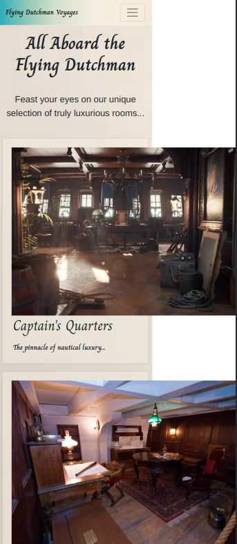

I made sure to add sizing rules to all images and flex styling to their containers to fix this. 

#### **Cloudinary Image Alt Text**

The first time I ran the HTML through the [**_W3C Markup Validation Service website_**](https://validator.w3.org/), I was immediately met with errors on all of my image tags due to the lack of alt text on each of them. This was caused by my misunderstanding of the metadata information on the Cloudinary platform, as I had entered in a caption and description crediting the source of the image to each and every one of them. However, this metadata does not automatically track, so to fix this I updated my Room model to include a field below each image for alt text, which is now pulled through to the templates.

## **Post Development Testing**

### **Post Development Bugs**

#### **Static Files**

I had some issues with my static files when deploying to Heroku with Debug set to False, in that I had not used the collectstatic command to upload my local files to Cloudinary, where they are being hosted. This initially caused me to think the issue was with my local CSS file itself, so it resulted in unnecessary changes that needed to be undone before correctly using the command.

#### **Check Availability Function 1**

When checking the booking functionality for each room on the deployed site, I came across a major issue with one of the rooms. When I was attempting to make a booking for it, I was receiving the form validation error _"This room is not available for this departure date."_ despite being certain that no bookings had been made for that specific room on that specific date. Logging into the admin dashboard, I realised that there were no longer any bookings _at all_ for that room - meaning I must have deleted them all during booking deletion tests. I realised that the check_availability function that acts as part of form validation was only creating a list of existing bookings, and that if there were no existing bookings then it was automatically returning False. I used print statements to determine what data was being passed in and out of the function, and then fixed the bug by adding lines 13 & 14 in the screenshot below:

As I was doing this, I also realised that the way I'd written the for loop meant that the check_availability function was only actually ever checking the date against the first booking on the list and then returning immediately, which was not ideal. So I added a variable called 'valid' and set it to True, then amended the if statement to update it to False and break out of the loop if it encountered a conflicting booking. The 'valid' variable is then passed back to the form for validation.

#### **Check Availability Function 2**

After fixing the previous bug, a friend helped me identify that there was another major issue arising from the logic I'd written that handled the form validation - amending an existing booking with the same date, but different number of passengers, would result in the same _"This room is not available for this departure date."_ validation error.

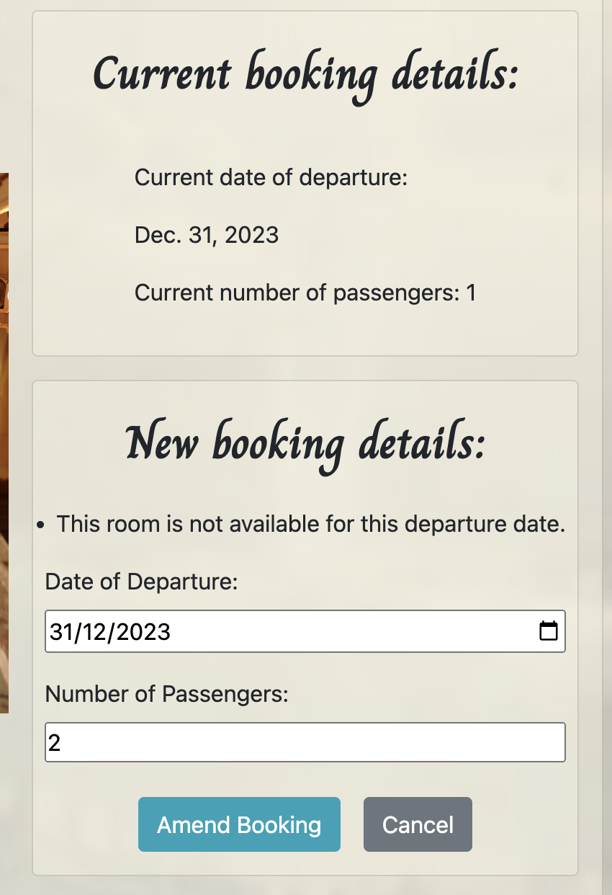

This was because the check_availability function was considering the booking being amended as being an existing booking that it clashed with. As both the create booking and amend booking processes use the same form, I fixed this by including an optional argument into the check_availability function, as well as additional rules in the form and related views that would mean I could modify the code on line 17 as shown in the screenshot below:

### **Responsive Design and Functionality**

This website's functionality has been tested and confirmed as fully responsive across different breakpoints on the following browsers:

* Google Chrome
* Mozilla Firefox
* Microsoft Edge
* Opera

The site has been briefly tested in Safari, however unfortunately there does seem to be a potential issue with one specific page due to flex-wrap. More details about this can be found in the [**_Unresolved Bugs_**](#unresolved-bugs) section below.

As mentioned in the [**_Testing Throughout Development_**](#testing-throughout-development) section above, the majority of responsiveness testing took place in Chrome's DevTools. However, in addition to this I sent the deployed website link to a small handful of friends and asked them to text on their devices - none of which came back with issues. I also tested the site in various browsers on my own mobile phone, which is a Xiaomi Poco X3 Pro, to make sure it wasn't just functional on major mobile brand screens.

### **Site Validation**

#### **HTML and CSS**

The HTML for every page was individually tested through the [**_W3C Markup Validation Service website_**](https://validator.w3.org/), by both direct input (gained through Chrome's DevTools to ensure everything was included) and by URI input.

All site pages have been tested and all are free from issues.

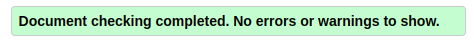

Similarly, all CSS has been validated by the [**_W3C CSS Validation Service website_**](https://jigsaw.w3.org/css-validator/). I entered only my own CSS by direct input first to confirm there were no issues, and after that entered each page's URI for validation.

All site pages came back without any issues.

#### **PEP8**

The two resources I used to validate my Python code were the VSCode extension 'Flake8', and the [**_Code Institute Python Linter_**](https://pep8ci.herokuapp.com/#).

The majority of this project's .py files came back without any issues.

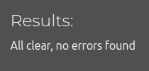

However, the following four .py files do come back with one specific error: _"line too long"_:

**In fd_bookings:**
forms.py: 8 total lines too long
models.py: 5 total lines too long
urls.py: 4 total lines too long

**In flying_dutchman:**
settings.py: 6 total lines too long

In the case of settings.py, Django has advised not to shorten these lines, so I did not change them.

For the three files that are in the fd_bookings app, I searched online about the best way to fix this and the general consensus was to keep them as they were. For this reason I have left them as they are.

#### **Accessibility**

I ran all website pages through the [**_WAVE Accessibility Evaluation Tool_**](https://wave.webaim.org/), and found only one issue - a contrast error on the Bootstrap info button styling.

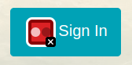

However, this did not seem to be the case on all pages - notably the homepage:

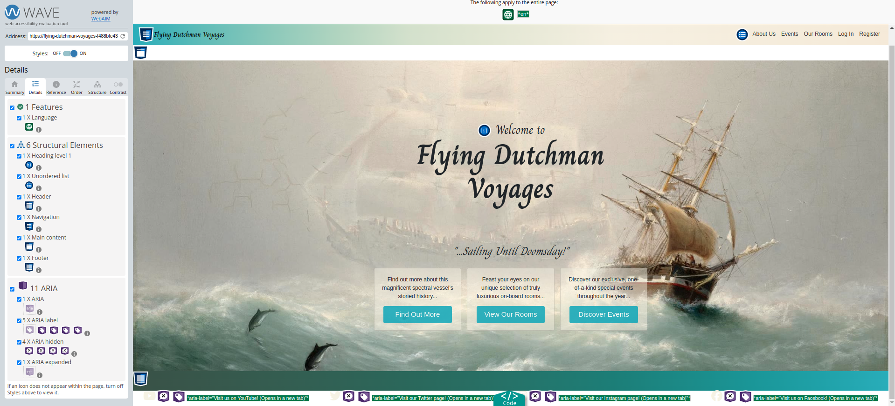

I also ran the website pages through the WCAG Colour Checker, which all passed with AA and AAA standard, once again with the exception of the Bootstrap info button, which was only considered AA on some pages. I did play around with the styling of this button by doing things like making the text larger/bolder, but neither of these had an effect.

#### **Lighthouse Scores and Cloudinary**

On desktop, my average Lighthouse validation scores for performance were between 95 and 100. The accessibility score drops from 100 to 94-95 on some pages, and upon investigation I found it was due to Bootstrap's info button styling.

Unfortunately, on mobile I only saw one page get into the green for performance, which was the Our Rooms page, however most of the pages are above 84 with the exception of the About Us page.

Initially, I was getting much lower scores across the board - in the 60s & 70s for mobile, and in the 80s for desktop. Looking into why this was, I found that part of the reason was Bootstrap, which cannot be helped, but I also realised that I had not taken into consideration the size of the image files that were being served by Cloudinary - the browser was trying to render them at full size and quality, even on smaller screens. To remedy this, I looked into how I could adjust the images based on where they were being served on the website, and found that (quite annoyingly) Cloudinary includes its responsive image options in the middle of the URLs, rather than at the end. This meant that I was unable to add the additional rules to any images that were being inserted into templates by Django, so I read through the relevant parts of Cloudinary's documentation to find a workaround. In the end I was able to massively improve overall scores by including Cloudinary-specific data strings in my templates, rather than putting the URL inside image tags. I also decided to add specific quality rules into the background images used in my CSS, which helped improve the scores.

Despite this, there are still some performance issues with a couple of pages - mostly the About Us page on mobile due to the need for the images to remain high enough quality when at full height on desktop and tablet.

All Lighthouse tests were performed using the published Heroku link, and done in an Incognito window.

**Homepage:**

**About Us:**

**Events:**

**Our Rooms:**

**Room Details:**

**My Bookings:**

**Booking Success:**

**Amend Booking:**

**Cancel Booking:**

**Login:**

**Logout:**

**Register:**

**Login Error:**

#### **PageSpeed Insights**

Across the board, my PageSpeed Insights were lower than the Lighthouse scores - averaging at around 95 on Desktop and 70-80 on mobile, averaging at around 78. The insights provided were largely the same as the ones given by Lighthouse, and mostly had to do with using external stylesheets, and the Cloudinary image sizes.

### **Unresolved Bugs**

#### **Safari**

As mentioned in the [**_Responsive Design and Functionality_**](#responsive-design-and-functionality) section above, there is a potential issue with one page of the website in particular when viewed in the Safari browser, though I cannot confirm how consistent this is. When testing the website across multiple browsers, I was able to briefly utilise [**_BrowserStack_**](https://www.browserstack.com/) to see how the website rendered in Safari on various devices. When I loaded the Our Rooms page, these were the results I got:

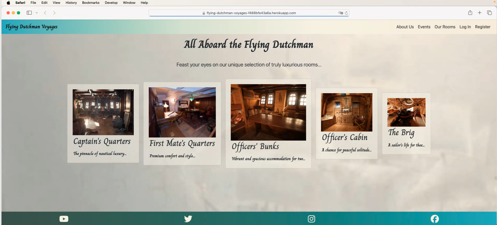

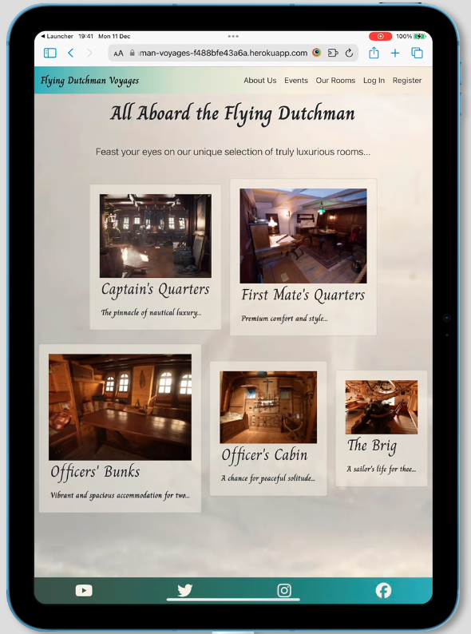

Unfortunately, as I don't own any Apple products, I wasn't able to replicate this or text it thoroughly in order to determine the issue. My own research into this suggests that the issue may be down to flex-wrap.

However, I sent the website link to a friend who does own a Mac, and he sent back the following screenshots, suggesting that it is working as intended:

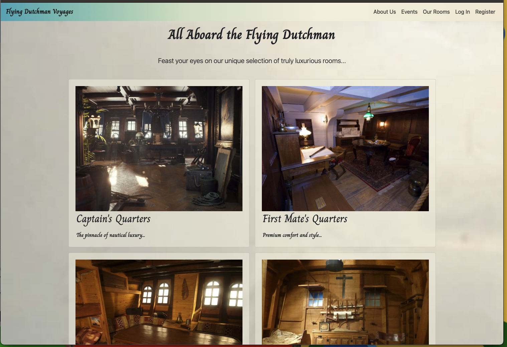

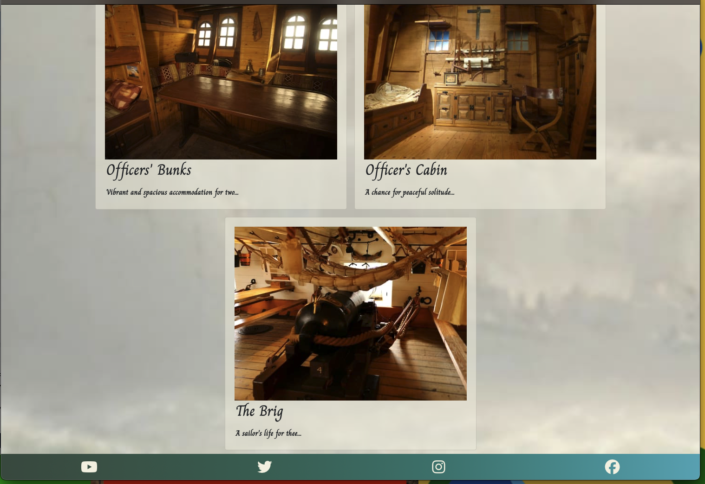

He was unable to replicate what I had seen on BrowserStack, however I am still including it here as acknowledgement that this may need future consideration.

## **User Story Testing**

Below I have recorded the acceptance criteria for each of the completed User Stories. I have merged some User Stories together as they shared a lot of similar criteria. Please note that I have not included the Contact User Stories here, for reasons explained in my separate [**_AGILE.md_**](AGILE.md) document.

### **As a Site User I can...**

| **_...create an account so that I am able to make and manage my bookings, and clearly see that I am logged in so that I know I am able to make and manage my bookings._** | **Complete?** |
| :------- | :-------: |
| Can easily find and access the Register page in the navbar | &check; |
| Can register with a username and (optional) email | &check; |
| Can easily find and access the Login page in the navbar | &check; |
| Redirection to the homepage upon successful login | &check; |
| Able to make bookings immediately once logged in | &check; |
| Can easily find and access the My Bookings page in the navbar when logged in, not visible when not logged in | &check; |
| Login error given when attempting to make a booking while not logged in | &check; |
| Entering a booking ID into the URL that does not exist/belongs to another user causes 404 error | &check; |
| Can securely access all booking functionality associated with user account only | &check; |

| **_...access the booking calendar so that I can see the dates available to book trips, and can create a booking so that I can secure a place on a voyage._** | **Complete?** |
| :------- | :-------: |
| Can easily find and access the Our Rooms page in the navbar when not logged in | &check; |
| Can easily find and access the Our Rooms page in the navbar when logged in | &check; |
| Can clearly see all five room options including an image and some flavour text for each one | &check; |
| Clicking into a specific room shows information and images specific to that room | &check; |
| Can clearly see the room details when not logged in | &check; |
| Can clearly see the room details when logged in | &check; |
| Can clearly identify the booking calendar on the specific room page | &check; |
| Login error given when attempting to make a booking while not logged in | &check; |
| When entering information into the booking form that is invalid, can clearly see a validation error explaining which piece of information is invalid | &check; |
| If trying to make a booking for a date on which that specific room is already booked, can clearly see the validation error explaining that this is the case | &check; |
| Can clearly see information on room detail pages about the duration of the voyage | &check; |
| Can clearly see information and link to the About Us page to find out more information about voyages | &check; |
| Entering a room ID into the URL that does not exist causes 404 error | &check; |
| Clear confirmation received when a booking is successful, linking to the My Bookings page to review | &check; |

| **_...can manage any bookings I have made so that I can edit or delete them as necessary._** | **Complete?** |
| :------- | :-------: |
| Can easily find and access the My Bookings page in the navbar when logged in, not visible when not logged in | &check; |
| Can clearly see a list of bookings made, with most recent bookings showing first | &check; |
| Can clearly see an option to amend each booking separately | &check; |
| Clicking on an 'amend booking' link redirects to a new page containing details about current booking with a new form | &check; |
| When entering information into the booking form that is invalid, can clearly see a validation error explaining which piece of information is invalid | &check; |
| When amending the number of passengers for a booking but keeping the same date, the form acknowledges this by validating user ID and allows the amendment | &check; |
| Clear confirmation received when a booking amendment is successful, linking to the My Bookings page to review | &check; |
| Can clearly see an option to cancel each booking separately | &check; |
| Clicking on a 'cancel booking' link redirects to a new page containing details of the booking, with clear text asking if the booking should be cancelled | &check; |
| Can see clear confirmation that a booking has been cancelled with message that appears on screen after redirecting back to My Bookings | &check; |
| Can securely access all booking functionality associated with user account only | &check; |
| Entering a booking ID into the URL to amend/cancel that does not exist/belongs to another user causes 404 error | &check; |

| **_...clearly navigate to the events section so that I can see all events that might be of interest to me._** | **Complete?** |
| :------- | :-------: |
| Can easily find and access the Events page in the navbar when not logged in | &check; |
| Can easily find and access the Events page in the navbar when logged in | &check; |
| Can clearly see an contact email address at the top of the Events page for any queries | &check; |
| Can clearly see that the company holds holiday-specific events together with engaging images | &check; |
| Can clearly see information about the main Easter Sunday event along with engaging images | &check; |
| Can clearly see disclaimers about the nature of the main Easter Sunday event and its risks | &check; |

### **As a Site Admin I can...**

| **_...securely login to the admin dashboard so that I can view and manage booking options, manage/delete user accounts, and can see bookings that have been made so that I can modify and delete them if necessary/contact the user with relevant information._** | **Complete?** |
| :------- | :-------: |
| Can successfully log in to the admin dashboard with ease | &check; |
| Admin panel is secure, only permitting superusers and staff to access | &check; |
| Can easily find and access the Room model data | &check; |
| Can easily add new rooms to the site through the dashboard | &check; |
| Can easily add edit existing rooms on the site through the dashboard | &check; |
| Can delete rooms from the site through the dashboard | &check; |
| Receive warning when trying to delete rooms attached to bookings to prevent booking data loss | &check; |
| Can easily find and access the Booking model data to view all bookings made through the site | &check; |
| Can easily filter bookings made on the site by user, booking_date, room, and the date on which the booking was created | &check; |
| Can easily search for bookings made on the site by user, booking_date, room, and the date on which the booking was created | &check; |
| Can easily amend bookings made on the site | &check; |
| Can easily delete bookings made on the site | &check; |

Please click the following link to return to the [**_README.md_**](README.md) document.