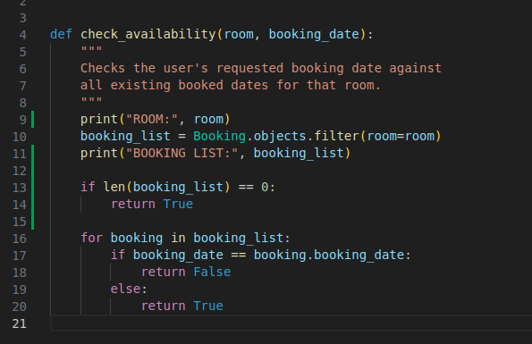
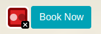
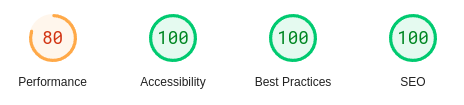

# **Flying Dutchman Voyages - Testing**

## **Table of Contents (Testing):**

1. [**Testing Throughout Development**](#testing-throughout-development)
    - [**Manual Testing**](#manual-testing)
        - [**_Python and Django Testing_**](#python-and-django-testing)
        - [**_Front End Testing_**](#front-end-testing)
    - [**Noteable Bugs During Development**](#noteable-bugs-during-development)
1. [**Post Development Testing**](#post-development-testing)
        - [**_Virtual Environment_**](#virtual-environment)
        - [**_Linking Templates_**](#linking-templates)
        - [**_Valid Form_**](#valid-form)
        - [**_Required Fields in Templates_**](#required-fields)
        - [**_Switching Database_**](#switching-database)
        - [**_Room Categories_**](#room-categories)
        - [**_Bookings Exceed Number of Passengers_**](#bookings-exceed-number-of-passengers)
        - [**_Flex vs Grid_**](#flex-vs-grid)
        - [**_Manual Form HTML_**](#manual-form-html)
        - [**_Cloudinary Image Alt Text_**](#cloudinary-image-alt-text)
        - [**_No Flexible Images_**](#no-flexible-images)
        - [**_Django Template Data Selection_**](#django-template-data-selection)
    - [**Post Development Bugs**](#post-development-bugs)
        - [**_Static Files_**](#static-files)
        - [**_Check Availability Function 1_**](#check-availability-function-1)
        - [**_Check Availability Function 2_**](#check-availability-function-2)
    - [**Responsive Design and Functionality**](#responsive-design-and-functionality)
    - [**Site Validation**](#site-validation)
        - [**_HTML and CSS_**](#html-and-css)
        - [**_PEP8_**](#pep8)
        - [**_Accessibility_**](#accessibility)
        - [**_Lighthouse Scores and Cloudinary_**](#lighthouse-scores-and-cloudinary)
        - [**_PageSpeed Insights_**](#pagespeed-insights)
    - [**Unresolved Bugs**](#unresolved-bugs)
        - [**_Safari_**](#safari)

## **Testing Throughout Development**

### **Manual Testing**

#### **Python and Django Testing**

look at screenshots in notes

#### **Front End Testing**

### **Noteable Bugs During Development**

I faced many bugs during the development process - most of which can be attributed to still being a beginner with Django. Below are the noteworthy bugs that I documented.

#### **Virtual Environment**

The first major issue I encountered as part of this project was that, due to using my own development environment on Ubuntu rather than using Code Institute's template in a cloud-based IDE, I was unable to install Python or Django to my local machine. To fix this, I learned how to set up a virtual environment on my machine and worked from there.

#### **Linking Templates**

Early on in the project, I had some issue getting to grips with the file paths needed to link templates to views. Two of my original templates linked to the views by wrapping just the filename in single quotes, 'rooms-list.html' and 'booking_list.html', but a third template, 'make_booking.html' would not work. I fixed this issue by learning that I needed to specify the filepath as 'fd_bookings/make_booking.html'.

#### **Valid Form**

I considered not including this one, but decided to in the end as it did take up a considerable amount of my time! When working on the views that handle my booking form, I came across a bug that had me stumped for nearly two hours. The form was there in the template, but no matter what I tried it wouldn't submit to the database. I scoured the internet, combed through all of my code (or so I thought) for so long it gave me a headache - until I finally realised it was because within the view I'd written "valid_form()" instead of "form_valid()"..!

#### **Required Fields in Templates**

The very early structure of my project included a dictionary with room categories inside, which determined the overall logic flow of the website and form. The 'make_booking.html' template originally served as the only place users could make a booking, and so the form fields included a dropdown list of room category names. This was marked as 'required' in the form, which caused bugs later on when I started changing the way the form looked in the webpages. At the time I had manually written the HTML for the form by first running the form.as_p and then getting the IDs from each element in DevTools, so when I changed the website structure to have one page per room, and removed the dropdown list from the template, trying to make a booking would throw an error because the user was unable to even enter a form field that I'd marked as required. To fix this, I used print statements in various locations within the function in RoomDetailView so that I could see where the code stopped being read, and what it was reading if it was being read. After realising it was because the form still included the 'required' field where it no longer needed to, I removed it from the form. I also decided to go back to rendering the form.as_p as I was unable to access Django's built-in form validation errors.

#### **Switching Database**

About half-way through development, I logged into ElephantSQL so that I could visually see the information that was in my database, only to realise that I had not linked the database to the project in the settings.py file. When I did this, I of course needed to create a new superuser, and enter in the room data through the admin dashboard from scratch. Not necessarily a bug, but it did set me back a little.

#### **Room Categories**

As mentioned above, originally my Room model contained a dictionary of room category names 

#### **Bookings Exceed Number of Passengers**

#### **Flex vs Grid**

#### **Manual Form HTML**

#### **Cloudinary Image Alt Text**

#### **No Flexible Images**

#### **Django Template Data Selection**

## **Post Development Testing**

### **Post Development Bugs**

#### **Static Files**

I had some issues with my static files when deploying to Heroku with Debug set to False, in that I had not used the collectstatic command to upload my local files to Cloudinary, where they are being hosted. This initially caused me to think the issue was with my local CSS file itself, so it resulted in unnecessary changes that needed to be undone before correctly using the command.

#### **Check Availability Function 1**

When checking the booking functionality for each room on the deployed site, I came across a major issue with one of the rooms. When I was attempting to make a booking for it, I was receiving the form validation error _"This room is not available for this departure date."_ despite being certain that no bookings had been made for that specific room on that specific date. Logging into the admin dashboard, I realised that there were no longer any bookings _at all_ for that room - meaning I must have deleted them all during booking deletion tests. I realised that the check_availability function that acts as part of form validation was only creating a list of existing bookings, and that if there were no existing bookings then it was automatically returning False. I used print statements to determine what data was being passed in and out of the function, and then fixed the bug by adding lines 13 & 14 in the screenshot below:

As I was doing this, I also realised that the way I'd written the for loop meant that the check_availability function was only actually ever checking the date against the first booking on the list and then returning immediately, which was not ideal. So I added a variable called 'valid' and set it to True, then amended the if statement to update it to False and break out of the loop if it encountered a conflicting booking. The 'valid' variable is then passed back to the form for validation.

#### **Check Availability Function 2**

After fixing the previous bug, a friend helped me identify that there was another major issue arising from the logic I'd written that handled the form validation - amending an existing booking with the same date, but different number of passengers, would result in the same _"This room is not available for this departure date."_ validation error.

This was because the check_availability function was considering the booking being amended as being an existing booking that it clashed with. As both the create booking and amend booking processes use the same form, I fixed this by including an optional argument into the check_availability function, as well as additional rules in the form and related views that would mean I could modify the code on line 17 as shown in the screenshot below:

### **Responsive Design and Functionality**

This website's functionality has been tested and confirmed as fully responsive across different breakpoints on the following browsers:

* Google Chrome
* Mozilla Firefox
* Microsoft Edge
* Opera

The site has been briefly tested in Safari, however unfortunately there does seem to be a potential issue with one specific page due to flex-wrap. More details about this can be found in the [**_Unresolved Bugs_**](#unresolved-bugs) section below.

As mentioned in the [**_Testing Throughout Development_**](#testing-throughout-development) section above, the majority of responsiveness testing took place in Chrome's DevTools. However, in addition to this I sent the deployed website link to a small handful of friends and asked them to text on their devices - none of which came back with issues. I also tested the site in various browsers on my own mobile phone, which is a Xiaomi Poco X3 Pro, to make sure it wasn't just functional on major mobile brand screens.

### **Site Validation**

#### **HTML and CSS**

The HTML for every page was individually tested through the [**_W3C Markup Validation Service website_**](https://validator.w3.org/), by both direct input (gained through Chrome's DevTools to ensure everything was included) and by URI input.

All site pages have been tested and all are free from issues.

Similarly, all CSS has been validated by the [**_W3C CSS Validation Service website_**](https://jigsaw.w3.org/css-validator/). I entered only my own CSS by direct input first to confirm there were no issues, and after that entered each page's URI for validation.

All site pages came back without any issues.

#### **PEP8**

The two resources I used to validate my Python code were the VSCode extension 'Flake8', and the [**_Code Institute Python Linter_**](https://pep8ci.herokuapp.com/#).

The majority of this project's .py files came back without any issues.

However, the following four .py files do come back with one specific error: _"line too long"_:

**In fd_bookings:**
forms.py: 8 total lines too long
models.py: 5 total lines too long
urls.py: 4 total lines too long

**In flying_dutchman:**
settings.py: 6 total lines too long

In the case of settings.py, Django has advised not to shorten these lines, so I did not change them.

For the three files that are in the fd_bookings app, I searched online about the best way to fix this and the general consensus was to keep them as they were. For this reason I have left them as they are.

#### **Accessibility**

I ran all website pages through the [**_WAVE Accessibility Evaluation Tool_**](https://wave.webaim.org/), and found only one issue - a contrast error on the Bootstrap info button styling.

However, this did not seem to be the case on all pages - notably the homepage:

I also ran the website pages through the WCAG Colour Checker, which all passed with AA and AAA standard, once again with the exception of the Bootstrap info button, which was only considered AA on some pages. I did play around with the styling of this button by doing things like making the text larger/bolder, but neither of these had an effect.

#### **Lighthouse Scores and Cloudinary**

On desktop, my average Lighthouse validation scores for peformance were between 95 and 100. The accessibility score drops from 100 to 94-95 on some pages, and upon investigation I found it was due to Bootstrap's info button styling.

Unfortunately, on mobile I only saw one page get into the green for performance, which was the Our Rooms page, however most of the pages are above 84 with the exception of the About Us page.

Initially, I was getting much lower scores across the board - in the 60s & 70s for mobile, and in the 80s for desktop. Looking into why this was, I found that part of the reason was Bootstrap, which cannot be helped, but I also realised that I had not taken into consideration the size of the image files that were being served by Cloudinary - the browser was trying to render them at full size and quality, even on smaller screens. To remedy this, I looked into how I could adjust the images based on where they were being served on the website, and found that (quite annoyingly) Cloudinary includes its responsive image options in the middle of the URLs, rather than at the end. This meant that I was unable to add the additional rules to any images that were being inserted into templates by Django, so I read through the relevant parts of Cloudinary's documentation to find a workaround. In the end I was able to massively improve overall scores by including Cloudinary-specific data strings in my templates, rather than putting the URL inside image tags. I also decided to add specific quality rules into the background images used in my CSS, which helped improve the scores.

Despite this, there are still some performance issues with a couple of pages - mostly the About Us page on mobile due to the need for the images to remain high enough quality when at full height on desktop and tablet.

All Lighthouse tests were performed using the published Heroku link, and done in an Incognito window.

**Homepage:**

**About Us:**

**Events:**

**Our Rooms:**

**Room Details:**

**My Bookings:**

**Booking Success:**

**Amend Booking:**

**Cancel Booking:**

**Login:**

**Logout:**

**Register:**

**Login Error:**

#### **PageSpeed Insights

Across the board, my PageSpeed Insights were lower than the Lighthouse scores - averaging at around 95 on Desktop and 70-80 on mobile, averaging at around 78. The insights provided were largely the same as the ones given by Lighthouse, and mostly had to do with using external stylesheets, and the Cloudinary image sizes.

### **Unresolved Bugs**

#### **Safari**

As mentioned in the [**_Responsive Design and Functionality_**](#responsive-design-and-functionality) section above, there is a potential issue with one page of the website in particular when viewed in the Safari browser, though I cannot confirm how consistent this is. When testing the website across multiple browsers, I was able to briefly utilise [**_BrowserStack_**](https://www.browserstack.com/) to see how the website rendered in Safari on various devices. When I loaded the Our Rooms page, these were the results I got:

Unfortunately, as I don't own any Apple products, I wasn't able to replicate this or text it thoroughly in order to determine the issue. My own research into this suggests that the issue may be down to flex-wrap.

However, I sent the website link to a friend who does own a Mac, and he sent back the following screenshots, suggesting that it is working as intended:

He was unable to replicate what I had seen on BrowserStack, however I am still including it here as acknowledgement that this may need future consideration.
