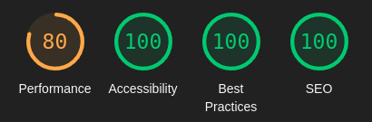
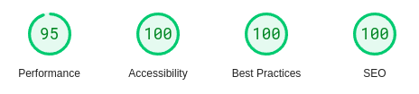

# **Flying Dutchman Voyages - Testing**

## **Table of Contents (Testing):**

1. [**Testing Throughout Development**](#testing-throughout-development)
    - [**Manual Testing Methods**](#manual-testing-methods)
    - [**Logic Validation**](#logic-validation)
    - [**Noteable Bugs During Development**](#noteable-bugs-during-development)
1. [**Post Development Testing**](#post-development-testing)
    - [**Post Development Bugs**](#post-development-bugs)
        - [**_Static Files_**](#static-files)
        - [**_Check Availability Function 1_**](#check-availability-function-1)
        - [**_Check Availability Function 2_**](#check-availability-function-2)
    - [**Responsive Design and Functionality**](#responsive-design-and-functionality)
    - [**Site Validation**](#site-validation)
        - [**_HTML and CSS_**](#html-and-css)
        - [**_PEP8_**](#pep8)
        - [**_Accessibility_**](#accessibility)
        - [**_Lighthouse Scores and Cloudinary_**](#lighthouse-scores-and-cloudinary)
        - [**_PageSpeed Insights_**](#pagespeed-insights)
    - [**Unresolved Bugs**](#unresolved-bugs)
    - [**Testing Final Deployed Site**](#testing-final-deployed-site)

## **Testing Throughout Development**

### **Manual Testing Methods**

### **Logic Validation**

### **Noteable Bugs During Development**

* Using & installing python & django on ubuntu - my_venv

* Linking templates

* "valid_form()"

* success_url & reverse/reverse_lazy (now removed from code)

* unable to make booking after removing room category name from template (+ screenshot)

* database

* changing from room categories to room names had a bigger knock-on effect than anticipated

* trying to use Bootstrap grid and flex in the same page = break

* trying to input form manually meant that no validation errors could be generated

* sweetify/sweet alert 2 css overriding bootstrap css (now removed)

* images not shrinking responsively when everything else was

* confusion between room.[data] and booking.room.[data]

## **Post Development Testing**

### **Post Development Bugs**

#### **Static Files**

I had some issues with my static files when deploying to Heroku with Debug set to False, in that I had not used the collectstatic command to upload my local files to Cloudinary, where they are being hosted. This initially caused me to think the issue was with my local CSS file itself, so it resulted in unnecessary changes that needed to be undone before correctly using the command.

#### **Check Availability Function 1**

When checking the booking functionality for each room on the deployed site, I came across a major issue with one of the rooms. When I was attempting to make a booking for it, I was receiving the form validation error _"This room is not available for this departure date."_ despite being certain that no bookings had been made for that specific room on that specific date. Logging into the admin dashboard, I realised that there were no longer any bookings _at all_ for that room - meaning I must have deleted them all during booking deletion tests. I realised that the check_availability function that acts as part of form validation was only creating a list of existing bookings, and that if there were no existing bookings then it was automatically returning False. I used print statements to determine what data was being passed in and out of the function, and then fixed the bug by adding lines 13 & 14 in the screenshot below:

As I was doing this, I also realised that the way I'd written the for loop meant that the check_availability function was only actually ever checking the date against the first booking on the list and then returning immediately, which was not ideal. So I added a variable called 'valid' and set it to True, then amended the if statement to update it to False and break out of the loop if it encountered a conflicting booking. The 'valid' variable is then passed back to the form for validation.

#### **Check Availability Function 2**

After fixing the previous bug, it wasn't long before I realised that there was another major issue arising from the logic I'd written that handled the form validation - amending an existing booking with the same date, but different number of passengers, wout result in the same _"This room is not available for this departure date."_ validation error. This was because the check_availability function was considering the booking being amended as being an existing booking that it clashed with. As both the create booking and amend booking processes use the same form, I fixed this by including an optional argument into the check_availability function, as well as additional rules in the form and related views that would mean I could modify the code on line 17 as shown in the screenshot below:

### **Responsive Design and Functionality**

This website's functionality has been tested and confirmed as fully responsive across different breakpoints on the following browsers:

* Google Chrome
* Mozilla Firefox
* Microsoft Edge
* Opera

The site has been briefly tested in Safari, however unfortunately there does seem to be an issue with one specific page due to the utilisation of flex-wrap. More details about this can be found in the [**_Unresolved Bugs_**](#unresolved-bugs) section below.

### **Site Validation**

#### **HTML and CSS**

HTML - link to Accessibility below

#### **PEP8**

[Code Institute Python Linter](https://pep8ci.herokuapp.com/#)

#### **Accessibility**

HTML validation made me realise that Cloudinary alt text wasn't pulling through, leading to amending the Room model to include it

#### **Lighthouse Scores and Cloudinary**

On desktop, my average Lighthouse validation scores for peformance were between 95 and 100. The accessibility score drops from 100 to 94-95 on some pages, and upon investigation I found it was due to Bootstrap's info button styling.

Unfortunately, on mobile I only saw one page get into the green for performance, which was the Our Rooms page, however most of the pages are above 84 with the exception of the About Us page.

Initially, I was getting much lower scores across the board - in the 60s & 70s for mobile, and in the 80s for desktop. Looking into why this was, I found that part of the reason was Bootstrap, which cannot be helped, but I also realised that I had not taken into consideration the size of the image files that were being served by Cloudinary - the browser was trying to render them at full size and quality, even on smaller screens. To remedy this, I looked into how I could adjust the images based on where they were being served on the website, and found that (quite annoyingly) Cloudinary includes its responsive image options in the middle of the URLs, rather than at the end. This meant that I was unable to add the additional rules to any images that were being inserted into templates by Django, so I read through the relevant parts of Cloudinary's documentation to find a workaround. In the end I was able to massively improve overall scores by including Cloudinary-specific data strings in my templates, rather than putting the URL inside image tags. I also decided to add specific quality rules into the background images used in my CSS, which helped improve the scores.

Despite this, there are still some performance issues with a couple of pages - mostly the About Us page on mobile due to the need for the images to remain high enough quality when at full height on desktop and tablet.

All Lighthouse tests were performed using the published Heroku link, and done in an Incognito window.

**Homepage:**

**About Us:**

**Events:**

**Our Rooms:**

**Room Details:**

**My Bookings:**

**Booking Success:**

**Amend Booking:**

**Cancel Booking:**

**Login:**

**Logout:**

**Register:**

**Login Error:**

#### **PageSpeed Insights

Across the board, my PageSpeed Insights were lower than the Lighthouse scores - averaging at around 95 on Desktop and 70-80 on mobile, averaging at around 78. The insights provided were largely the same as the ones given by Lighthouse, and mostly had to do with using external stylesheets, and the Cloudinary image sizes.

### **Unresolved Bugs**

* our rooms - safari (screenshot)

